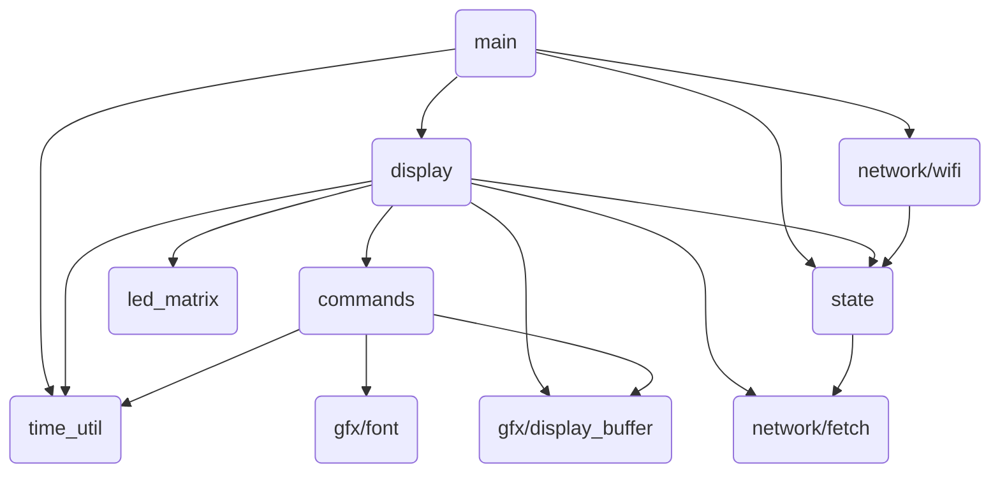
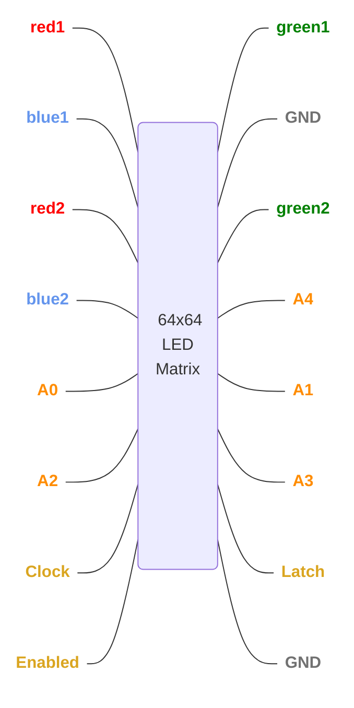

<!--
title: Illumindex
description: An exploration of display drivers and IoT systems, from scratch.
active: false
slug: illumindex
tags: esp32, esp32-s2, Espressif, 3D-printing, graphics, highlight, Node.js, iot
date: 11/29/2025
lastModified: 11/29/2025
image: /assets/illumindex/cover.png
-->

<!--
TODO:
- Why I didn't use MQTT
-
-->

## About

This project started as a simple idea: I wanted a small display on my desk that could show bits of information throughout the day. There are already a ton of these informational displays on the market, but if I’m being honest, actually having the display was never as interesting to me as building it. I’d always wondered how LED matrix displays worked, and combining one with networking sounded like a great excuse to also explore IoT development.

Thus "Illumindex" was born, short for "Illuminated Information Index" (yes, the second "i" stands for information, not index). It is not a great name, but I am terrible at naming things, and that is not really the point of this project anyway.

The hardware for this project is incredibly minimal, so this post will focus mostly on the software. I will be diving very deep into many different aspects of the code, and hopefully you will learn something interesting along the way. At the very least, each section begins with a high-level overview, so even skimming the article should be somewhat interesting.

### Architectural Overview

Since this was my first exploration into the world of IoT, I wanted to focus heavily on the embedded side of the project. Specifically, I wanted hands-on experience writing a decently robust network stack for the firmware. This included everything from establishing a WiFi connection, handling reconnections, and syncing with NTP servers, to wrapping low-level HTTP requests with a higher-level "fetch" abstraction for working with JSON REST endpoints. Luckily, ESP-IDF provides a vast library of APIs that handle most of the extremely low-level networking details (alas, I did not write my own TCP/IP stack).

Outside of the network stack, I also wanted to build the display driver and a small set of utilities for working with bitmap graphics, including custom ASCII fonts, simple shapes, and graphs. But I didn’t want to base these on code I had seen elsewhere or simply copy other solutions. I wanted to genuinely learn the challenges of these systems and write the implementations according to my own understanding and capabilities.

That is not to say I avoided other libraries or articles. All of the code here is my own, but I gained a huge amount of insight and direction from open-source projects and technical articles, many of which were incredibly helpful in guiding me through difficult problems. I will discuss these sources in their relevant sections below.

For the cloud backend, I went with what I know well from work. The backend is written in TypeScript/Node.js and hosted on one of [Vercel’s hobby plans](https://vercel.com/pricing). For simplicity of maintenance, speed of execution, and cost, Vercel made the most sense to me. I initially planned to use Next.js as a quick way to deliver simple Node.js logic to [Lambda functions](https://aws.amazon.com/lambda/), but I eventually added some UI development utilities to the application that can also be accessed via the local development server.

### AI/LLM Involvement

It’s the end of 2025 at the time of writing. LLMs are everywhere and anyone in the tech industry is aware that they're nearly inescapable at this point. Endless discussions are being had about the future of software engineering and how LLMs fit into it – or maybe, how humans fit into it. I don’t believe this article is the place for me to brain dump my opinions. However, I will say that I am especially concerned with patterns we are beginning to see. More and more engineers use LLMs to achieve a goal, but then move on without taking time to learn from the problems that they have just solved.

I believe that growth in _engineering fundamentals_ is a journey that never ends, and outsourcing thought and understanding to LLMs will have deep, negative impacts on engineers in the long run. Less human involvement in software engineering may be the future, and that's okay. But for now, I _like_ software engineering and deeply value the growth that comes from understanding a problem and designing a solution.

This project was written without _any_ LLM "agent" involvement. It _was_ written with LLM autocomplete "suggestions". To me, this is the perfect symbiosis between LLMs and software engineering. It allows me to drive the line-by-line architecture of the system, encounter problems, explore solutions, choose the directions of the software, and maintain a deep understanding of the system, while at the same time speeding up development and reducing physical fatigue.

This article, however, has been significantly reviewed and edited by an LLM. I've written all initial versions, but I've also passed the output to an LLM for corrections and consistency.

## Software

> The software is open source and available at [github.com/zbauman3/illumindex](https://github.com/zbauman3/illumindex).

While the firmware was built using Espressif's [ESP-IDF](https://docs.espressif.com/projects/esp-idf/en/v5.3.1/esp32s3) (through their wonderful [ESP-IDF Extension for VSCode](https://docs.espressif.com/projects/vscode-esp-idf-extension/)), there were no other dependencies in this project outside of the standard library that the the ESP-IDF provides. Since this was a learning experience, rather than a project with a deadline, I wanted to make sure that I was involved in writing all of the application logic.

I broke down the individual pieces of the firmware into logical sections, depending on their purpose. The ESP-IDF has a concept for this called [Components](https://docs.espressif.com/projects/esp-idf/en/v5.3.1/esp32s3/api-guides/build-system.html#concepts). These components are: [led_matrix](), [network](), [gfx](), [commands](), [display](), [state](), and [time_util]().

I'll talk about each of these components in detail below.

 

### led_matrix

The core part of this project is arguably the display driver. It's also the reason I wanted to do this project in the first place. So this component is the one that I easily spent the most time on. I watched a lot of YouTube videos and read a lot of articles on how these display drivers work. But I ultimately ended up getting the best overview from [this lovely article](https://bikerglen.com/projects/lighting/led-panel-1up/) by [Glen Akins](https://www.youtube.com/@GlenAkins/videos). Much of what I will talk about below is covered in much more detail there.

#### The theory

Before diving into the software, it's important to understand the physical layer that the display driver interacts with. LED matrix displays are never fully "on" all at once. Instead, we cycle through all of the rows of the display, two rows on at a time, fast enough to trick the human eye into thinking all rows are lit up. Each pixel is only ever on or off, so dimming is done by changing the amount of time a pixel is on. So a 64x64 matrix is split into two horizontal halves of 64x32. Each of these halves consist of:

- 3x64 shift register with output latching & blanking
- 5 to 32 address decoder
- 2,048 RGB LEDs

The 3 shift registers control the red, green, and blue for each **column**. They have a latching circuit allows us to shift in all of the bits without showing them, then display them all at once by toggling the latch signal. It also has a blanking signal to disable all output.

The 5 to 32 address decoder controls the **row** that is active. This is the mechanism we use to quickly cycle through all rows of the display.

Finally, we have the pixels. The circuit can vary by manufacturer, but you can think of the shift registers as driving the `+` for the LEDs and the decoder as driving the `-`. In order to enable a given pixel, you must set the correct shift register/latch and decoder combination to target that pixel.

The physical connector for this system looks like this:

 

Now that we understand the hardware involved, we can discuss _how_ to show an image on the display. There are different algorithms for driving the display, but I built mine with [24 bit ("true color")](<https://en.wikipedia.org/wiki/Color_depth#True_color_(24-bit)>), so that is the algorithm I'll discuss here. This means that each pixel has 1 byte of data for each red, green, and blue.

1. For each of the 64 columns of a row, shift out bit `0` of the red, green, and blue bytes. This is done by setting the lines for red1, green1, blue1, red2, green2 and blue2 to the relevant value, pulsing the Clock line, then repeating for each column.
2. Disable output using the Enabled line.
3. Set the A0 ... A4 address lines to the value for the row about to be shown.
4. Pulse the Latch line to latch the contents of the shift registers to the outputs.
5. Enable output using the Enabled line.
6. Wait for some amount of time (more on this below).
7. Repeat the process for all 2x32 rows.

These steps will show the lowest bit of each color's byte on the display. Once we've completed a scan of all rows for this first bit in each color, we repeat the process for the next bit by increasing the active bit in step `1` and multiply the amount of time we wait in step `6` by an increasing power of 2. This change in step `6` means that as we spend twice and much time on each bit as the previous one. The result is that a larger number for a color means that the color is displayed for a longer period, tricking the human eye into seeing it brighter.

#### The implementation

There's many ways to implement this algorithm with the hardware and peripherals in an ESP32-S3 – DMA, octal SPI, dedicated GPIO bundles, individual GPIO bit banging, and more. What you choose is largely dependent on the time you want to invest, familiarity with the peripherals, and the requirements of the overall system.

For my implementation, I chose to use a combination of [Dedicated GPIO](https://docs.espressif.com/projects/esp-idf/en/v5.3.1/esp32s3/api-reference/peripherals/dedic_gpio.html), standard GPIO, and [General Purpose Timers](https://docs.espressif.com/projects/esp-idf/en/v5.3.1/esp32s3/api-reference/peripherals/gptimer.html). Using these peripherals through the ESP-IDF provides a lot of niceties and protection logic. But when trying to build a performant display driver in software, those features actually slowed down the driver significantly. As a result, I instead decided to use the ESP-IDF's [Hardware Abstraction Layer APIs](https://github.com/espressif/esp-idf/tree/v5.3.1/components/hal). These are somewhat unstable APIs, as they are likely to change from version to version of the ESP-IDF. Using the "Lower Level" of these APIs gave even better performance, but with minimal protections. Looking at the source, these APIs are really just setting raw bits in registers, often using inline assembly:

 

Using Dedicated GPIO means that we can use bit masks to drive 8 bits in a single instruction. It turns out that this is great for working with the 6 bits for 2xRGB and the clock signal. This lets us shift out 1 bit with two instructions: clock low and data bits set, then clock high and data bits persist, then repeat. Unfortunately, with the ESP32-S3 running at 240 MHz, this is actually too fast for the shift registers in the display, and we have to add a nop cycle in there, too:

 

Putting all of this together, we can see that implementing the actual algorithm is fairly simple. This does not include the unrolled logic for shifting out a row, but it's the same as the snippet above, times 64:

### network

#### WiFi

#### Fetch

### gfx

#### Display Buffer

#### Fonts

- Bitmap Fonts: http://www.piclist.com/tecHREF/datafile/charset/extractor/charset_extractor.htm
  - https://bitmap-code-generator.benalman.com/

### commands

### display

### state

### time_util

 

## Hardware

The hardware for this project is nothing special. The MCU is an ESP32-S3 development board, connected to a 64x64 RGB LED Matrix panel. It is powered with a 5V 4A switching power supply. I also added a switch to toggle the MCU's power source between the USB port and the power supply, since there are no protection diodes for the USB port on the development board I used.

### Parts List

| Part                                                                                   | Description                                     |
| -------------------------------------------------------------------------------------- | ----------------------------------------------- |
| [Adafruit ESP32-S3 Feather](https://www.adafruit.com/product/5477)                     | The main MCU                                    |
| [64x64 RGB LED matrix panel](https://www.adafruit.com/product/5362)                    | The LED matrix panel                            |
| [5V 4A (4000mA) switching power supply](https://www.adafruit.com/product/1466)         | Power supply                                    |
| [2x8 IDC breakout pins](https://www.adafruit.com/product/2104)                         | Connection pins for the ribbon cable            |
| [2x8 IDC ribbon cable](https://www.adafruit.com/product/4170)                          | Connection between the MCU and the LED matrix   |
| [Black LED diffusion acrylic](https://www.adafruit.com/product/4594)                   | Makes the LEDs less harsh and easier to look at |
| [Adafruit Perma-Proto Half-sized Breadboard PCB](https://www.adafruit.com/product/571) | The board that everything is soldered to        |

 

## Media

  
  
  
  
  
  
  
  
  

## Downloads

### 3D Models

The body was printed with PETG. If I were to improve this design a little, I would have made it easier to plug in the USB cord without needing to disassemble the body.

- [Illumindex.step](https://github.com/zbauman3/illumindex/blob/main/hardware/Illumindex.step)

### Schematics

The schematic was designed with KiCad.

- [illumindex.kicad_sch](https://github.com/zbauman3/illumindex/blob/main/hardware/illumindex.kicad_sch)

