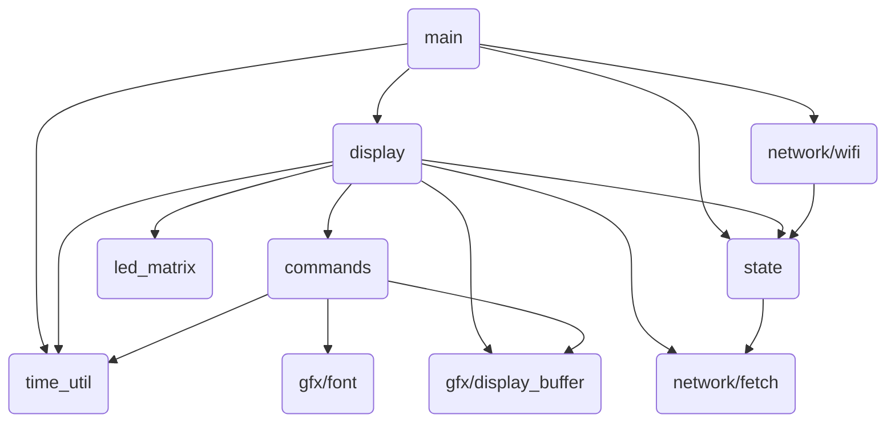

<!--
title: Illumindex
description: An exploration of display drivers and IoT systems, from scratch.
active: true
slug: illumindex
tags: esp32, esp32-s3, Espressif, 3D-printing, graphics, highlight, Node.js, iot
date: 12/21/2025
lastModified: 12/22/2025
image: /assets/illumindex/cover.png
-->

## About

This project started as a simple idea: I wanted a small display on my desk that could show bits of information throughout the day. There are already a ton of these informational displays on the market, but if I’m being honest, actually having the display was never as interesting to me as building it. I’d always wondered how LED matrix displays worked, and combining one with networking sounded like a great excuse to also explore IoT development.

Thus "Illumindex" was born, short for "Illuminated Information Index".

If you want to learn the nitty-gritty, low-level implementation of an LED matrix display and its driver – at the hardware and firmware level – this article will hopefully be informative and useful for you. If you just want to see the pictures and the parts list, [jump down to the sections after the software description](#aillm-involvement).

## Software

> The software is open source and available at [github.com/zbauman3/illumindex](https://github.com/zbauman3/illumindex).

The primary goal of this project, from a software perspective, was to learn how to build a display driver and design a small but complete IoT system from the ground up. To support that goal, I chose to write all of the application code myself. No third-party libraries are used in the firmware, only the manufacturer SDK, the roughly 4,000 lines of code that make up the system are entirely my own.

The project is built on top of the [ESP-IDF](https://docs.espressif.com/projects/esp-idf/en/v5.3.1/esp32s3/get-started/index.html), the official SDK provided by Espressif for the ESP32 family of microcontrollers. Using the ESP-IDF provides access to the underlying hardware, startup code, and toolchain support without abstracting away the details that are important when working close to the metal. It also provides some useful utilities that saved me a ton of time, like [cJSON](https://github.com/DaveGamble/cJSON).

For the backend, I used a simple serverless application built with Next.js and deployed on Vercel. This is what I use day to day at work, which made it easy to stand up a basic API endpoint and iterate. The backend primarily serves as a lightweight data source for the device, but also houses some visual development utilities like a local simulator that mirrors the current state of the LED matrix and a small utility for drawing and generating bitmaps.

### The Display Driver

The display driver is easily the most interesting part of this project, and will be covered in the most detail. For more detailed information on it, feel free to checkout the source code [here](https://github.com/zbauman3/illumindex/tree/main/firmware/components/led_matrix).

#### What is an LED Matrix?

Before diving into the software, it is important to understand the physical layer that the display driver interacts with. An LED matrix display is nothing more than a grid where each point is made from small red, green, and blue LEDs:

  

 

In an LED matrix display, not all LEDs are illuminated at the same time. Instead, only two rows are active at any given moment: one row on the top half of the display and one row on the bottom half. To show an image, the system rapidly cycles through all rows of the display, fast enough to exploit persistence of vision and appear as a solid image. Achieving this refresh speed is trivial for a microcontroller. The ESP32-S3 used in this project has two cores operating at 240 MHz, which allows one core to be dedicated to the display driver while the other handles everything else.

The display used here is a 64x64 RGB LED matrix. It is divided into two halves, top and bottom, with each half measuring 64x32 and containing its own control hardware. Each half uses three 64-bit shift registers, one for red, green, and blue, which represent the columns of the display. Between these shift registers and the LEDs are latch circuits. These latches allow the data for all 64 columns to be shifted in slowly and then displayed simultaneously by toggling the latch signal. The latches also expose an enable/disable signal, which is used by the driver algorithm described later.

Row selection is handled by a 5-to-32 address decoder. Conceptually, the address decoder selects which row is connected to the negative side of the circuit, while the shift registers determine which columns drive the positive side for red, green, and/or blue. With simple on/off control of red, green, and blue, the display is limited to eight colors: red, green, blue, cyan, magenta, yellow, black, and white. Producing additional colors requires more advanced techniques in the display driver that is described later.

Each half of the matrix has its own set of shift registers and latches. However, both halves share the clock signal for the shift registers, the latch control and enable signals, and the output from the address decoder. This means that while the columns on each half can be controlled independently, all other control signals operate in unison across the entire display.

Here's a simplified block diagram of these physical components:

  

 

#### The Algorithm

Now that we understand the hardware involved, we can discuss how to show an image on the display using software. There are several possible approaches for driving an LED matrix, but the driver described here is built around [24 bit, true color](<https://en.wikipedia.org/wiki/Color_depth#True_color_(24-bit)>). Each pixel is stored with one byte each for red, green, and blue. As discussed earlier, the hardware can only turn each color channel fully on or fully off, giving us just eight possible color combinations per pixel. To translate the three bytes of color data into the 16,777,216 possible colors of true color, the driver uses a form of [pulse-width modulation](https://en.wikipedia.org/wiki/Pulse-width_modulation) called binary coded modulation (BCM).

At a high level, the algorithm works by repeatedly displaying individual bits of the color data, holding more significant bits on the screen for longer periods of time. The steps below describe showing a single frame on the display:

1. For each of the 64 columns, set Red1, Green1, Blue1, Red2, Green2 and Blue2 to the value of `bit N` in the RGB bytes for the current row. Toggle the Clock line to shift this data into the registers.
2. Disable output using the Enabled line.
3. Set the A0 ... A4 address lines to select the row about to be displayed.
4. Pulse the Latch line to copy the contents of the shift registers to the outputs.
5. Enable output using the Enabled line.
6. Wait for a specific amount of time.
7. Repeat steps 1 through 6 for all 32 row addresses.
8. Increment `bit N` and repeat steps 1 through 7 for all 8 bits.

The most important part of this process is the delay in step 6. This delay is what enables binary coded modulation. A base time is chosen and multiplied by 2 raised to the power of the current bit index: `time * 2^bit`. For example, with a base time of 0.7 µs, the delays for each bit would be:

- Bit 0: 0.7µs
- Bit 1: 1.4µs
- Bit 2: 2.8µs
- Bit 3: 5.6µs
- Bit 4: 11.2µs
- Bit 5: 22.4µs
- Bit 6: 44.8µs
- Bit 7: 89.6µs

This means that more significant bits remain illuminated for longer periods, which causes larger numerical values to appear brighter to the human eye. This also enables mixing of different ratios of red, green, and blue to achieve "true color".

Choosing the base delay time is a balancing act between microcontroller performance and visible flickering. If the delay is too short, the MCU will not be able to complete all steps of the algorithm before moving on to the next row or bit. If the delay is too long, the total time required to draw all rows and bits increases, causing the display to appear flickery. Ideally, this value is tuned alongside the real-world execution time of the driver so that the entire display refreshes at a full-frame rate of roughly 120 to 240 Hz.

Here are the calculations I came up with for Illumindex:

 

In this calculation, `cycles` represents the number of CPU cycles required to execute the algorithm for a single bit. Dividing this value by the CPU frequency, accounting for miscellaneous overhead, and then multiplying by 8 gives us the total active CPU time needed to process one byte of color data (`oneByte`).

Next, the total delay time spent waiting between each bit (`rowTimers`) is added, and the result is multiplied by 32 to account for all rows in the display. This produces a full-screen refresh rate of 119.05 Hz. It's not a perfect 120, but it's good enough for me.

#### The Implementation

There are many ways to implement this algorithm on the ESP32-S3. For this project, I chose a combination of [Dedicated GPIO](https://docs.espressif.com/projects/esp-idf/en/v5.3.1/esp32s3/api-reference/peripherals/dedic_gpio.html), [Standard GPIO](https://docs.espressif.com/projects/esp-idf/en/v5.3.1/esp32s3/api-reference/peripherals/gpio.html), and [General Purpose Timer](https://docs.espressif.com/projects/esp-idf/en/v5.3.1/esp32s3/api-reference/peripherals/gptimer.html). While there are more efficient approaches (like using SPI with DMA) I wanted direct, fine-grained control over the output signals to keep the overall design and behavior easier to understand.

Using the ESP-IDF high-level APIs introduces noticeable overhead due to safety checks and conditional logic. Since the display driver algorithm needs to execute within a few thousand CPU cycles, that overhead adds up quickly. For lower-level, performance-critical code paths, ESP-IDF also exposes [Hardware Abstraction](https://docs.espressif.com/projects/esp-idf/en/v5.3.1/esp32s3/api-guides/hardware-abstraction.html) APIs. These APIs underpin large portions of the logic that the ESP-IDF is built on top of, and at the lower level they often interact with the hardware through inlined assembly calls in C, allowing GPIO operations to be performed in just a handful of CPU instructions. The tradeoff is that they require more care and discipline when writing and maintaining the code.

All runtime state for the LED matrix is stored in the `led_matrix_state_t` struct:

 

This struct contains pointers to the configured pins, pointers to the Dedicated GPIO bundle and the general-purpose timer, the display data buffer, and some additional state used by the driver. The row address pins (A0 through A4) and the output-enable pin are driven using standard GPIO, while the shift register pins for both halves of the display (the RGB data lines, clock, and latch) are controlled using Dedicated GPIO.

This split allows both the top and bottom row RGB values to be written to the shift registers in just two instructions. At 240 MHz, these writes occur so quickly that the shift registers themselves cannot keep up, requiring an explicit `nop` instruction to introduce a tiny delay between clock edges:

 

The implementation does not use double buffering, but the display data is pre-processed before being rendered. The frame buffer is stored as a byte array where each byte directly corresponds to a Dedicated GPIO output value. Each byte is laid out in the form `0,0,R1,G1,B1,R2,G2,B2`, with the remaining two bits reserved for control signals such as the clock and latch. This allows each column's RGB data for both rows to be shifted out with a single write operation.

The core rendering logic of the algorithm itself is relatively straightforward, and the loop for running this logic is controlled by the General Purpose Timer. One detail worth noting is that the `shift_out_row` function is a macro that unrolls the writes for all 64 columns.

Here's the implementation:

 

### Everything Else

Outside of the display driver, most of the software architecture is fairly mundane, so I will only cover it at a high level. The firmware is broken into logical units based on responsibility, using the ESP-IDF concept of [Components](https://docs.espressif.com/projects/esp-idf/en/v5.3.1/esp32s3/api-guides/build-system.html#concepts). Together, these components form a simple pipeline that moves data from the network to the display. At a glance, the firmware is composed of the following major components:

- [led_matrix](https://github.com/zbauman3/illumindex/tree/main/firmware/components/led_matrix) – the low-level display driver described earlier
- [gfx](https://github.com/zbauman3/illumindex/tree/main/firmware/components/gfx) – generic graphics primitives and bitmapped fonts
- [network](https://github.com/zbauman3/illumindex/tree/main/firmware/components/network) – WiFi management and HTTP request helpers
- [commands](https://github.com/zbauman3/illumindex/tree/main/firmware/components/commands) – parsing and representing display instructions received from the API
- [display](https://github.com/zbauman3/illumindex/tree/main/firmware/components/display) – orchestration of rendering and data flow
- [state](https://github.com/zbauman3/illumindex/tree/main/firmware/components/state) – shared application state
- [time_util](https://github.com/zbauman3/illumindex/tree/main/firmware/components/time_util) – time utilities

 

The `gfx` component provides low-level drawing primitives, including a display buffer and font support. These utilities operate on bitmapped graphics and expose functions for drawing text and lines.

The `network` component wraps ESP-IDF networking APIs and is responsible for managing the WiFi connection and making HTTP requests.

The `commands` component is responsible for transforming API responses into simplified C structures that represent drawing operations. Instead of transferring full bitmap data over the network, the API returns a compact set of commands that describe how to generate the image locally. These commands are then applied to the display buffer using the `gfx` primitives.

Finally, the `display` and `state` components tie the system together. They initialize all subsystems, periodically fetch new data via the `network` component, pass responses to `commands` for processing, apply the resulting drawing commands to the display buffer, and preprocess the final buffer for consumption by the LED matrix driver.

## AI/LLM Involvement

It’s the end of 2025 at the time of writing. LLMs are everywhere and anyone in the tech industry is aware that they're nearly inescapable at this point. Endless discussions are being had about the future of software engineering and how LLMs fit into it – or maybe, how humans fit into it. I don’t believe this article is the place for me to brain dump my opinions. But I'll say that I am concerned with the patterns that we are beginning to see. More and more engineers use LLMs to achieve a goal, but then move on without taking time to learn from the problems that they have just solved. This velocity is important for business objectives, but is not ideal for skills growth.

I believe that growth in _engineering fundamentals_ is a journey that never ends, and outsourcing thought and understanding to LLMs will have deep, negative impacts on engineers in the long run. Less human involvement in software engineering may be the future, and that's okay. But for now, I _like_ software engineering and deeply value the growth that comes from understanding a problem and designing a solution.

This project was written without _any_ LLM "agent" involvement. It _was_ written with LLM autocomplete "suggestions". To me, this is the perfect symbiosis between LLMs and software engineering. It allows me to drive the line-by-line architecture of the system, encounter problems, explore solutions, choose the directions of the software, and maintain a deep understanding of the system, while at the same time speeding up development and reducing physical fatigue.

This article, however, has been significantly reviewed and edited by an LLM. I've written all initial versions, but I've also passed the output to an LLM for corrections and consistency.

## Hardware

The hardware for this project is nothing special. The MCU is an ESP32-S3 development board, connected to a 64x64 RGB LED Matrix panel. It is powered with a 5V 4A switching power supply. I also added a switch to toggle the MCU's power source between the USB port and the power supply, since there are no protection diodes for the USB port on the development board I used.

### Parts List

| Part                                                                                   | Description                                     |
| -------------------------------------------------------------------------------------- | ----------------------------------------------- |
| [Adafruit ESP32-S3 Feather](https://www.adafruit.com/product/5477)                     | The main MCU                                    |
| [64x64 RGB LED matrix panel](https://www.adafruit.com/product/5362)                    | The LED matrix panel                            |
| [5V 4A (4000mA) switching power supply](https://www.adafruit.com/product/1466)         | Power supply                                    |
| [2x8 IDC breakout pins](https://www.adafruit.com/product/2104)                         | Connection pins for the ribbon cable            |
| [2x8 IDC ribbon cable](https://www.adafruit.com/product/4170)                          | Connection between the MCU and the LED matrix   |
| [Black LED diffusion acrylic](https://www.adafruit.com/product/4594)                   | Makes the LEDs less harsh and easier to look at |
| [Adafruit Perma-Proto Half-sized Breadboard PCB](https://www.adafruit.com/product/571) | The board that everything is soldered to        |

 

## Media

  
  
  
  
  
  
  
  
  

## Downloads

### 3D Models

The body was printed with PETG. If I were to improve this design a little, I would have made it easier to plug in the USB cord without needing to disassemble the body.

- [Illumindex.step](https://github.com/zbauman3/illumindex/blob/main/hardware/Illumindex.step)

### Schematics

The schematic was designed with KiCad.

- [illumindex.kicad_sch](https://github.com/zbauman3/illumindex/blob/main/hardware/illumindex.kicad_sch)

