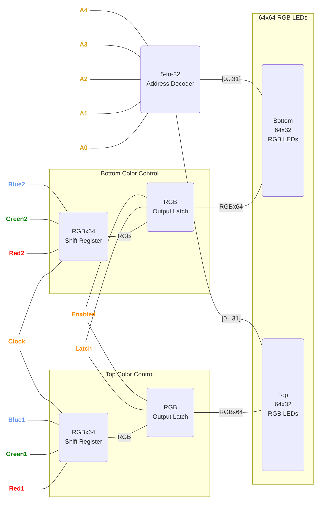
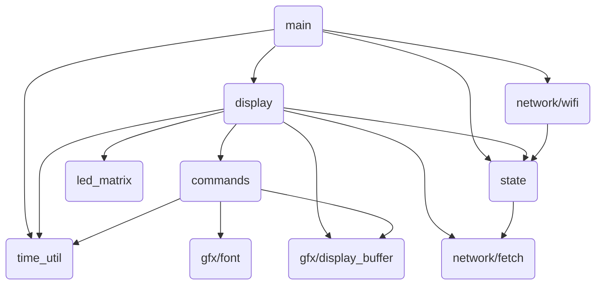

<!--
title: Illumindex
description: An exploration of display drivers and IoT systems, from scratch.
active: false
slug: illumindex
tags: esp32, esp32-s2, Espressif, 3D-printing, graphics, highlight, Node.js, iot
date: 11/29/2025
lastModified: 11/29/2025
image: /assets/illumindex/cover.png
-->

## About

This project started as a simple idea: I wanted a small display on my desk that could show bits of information throughout the day. There are already a ton of these informational displays on the market, but if I’m being honest, actually having the display was never as interesting to me as building it. I’d always wondered how LED matrix displays worked, and combining one with networking sounded like a great excuse to also explore IoT development.

Thus "Illumindex" was born, short for "Illuminated Information Index" (yes, the second "i" stands for information, not index). It is not a great name, but I am terrible at naming things, and that is not really the point of this project anyway.

## Software

### The Display Driver

> The software is open source and available at [github.com/zbauman3/illumindex](https://github.com/zbauman3/illumindex).

#### What is an LED Matrix?

Before diving into the software, it's important to understand the physical layer that the display driver interacts with. All LEDs are never illuminated at the same time in an LED matrix display. Instead, only two rows are illuminated at any given moment – one row on the top half of the display and one row on the bottom half. To show an image on the display, we must cycle through all rows of the display fast enough to trick the human eye into seeing a solid image. Luckily, achieving that speed is trivial for a computer. The ESP32-S3 I'm using for this project has two cores operating at 240MHz, which allows me to dedicate one core to the display driver and the other core to everything else.

The display I'm using is 64x64 RGB LEDs. The display is divided into two halves, top and bottom. Each half is 64x32 and has hardware to control that half. There are three 64-bit shift registers – one for red, green, and blue – that represent the columns of the display. Between these shift registers and the LEDs are latch circuits. This allows the the data for all 64 columns to be shifted in slowly and then shown all at once by toggling the latch signal. These latches also have a signal that can be used to enable/disable their output, which is used in the algorithm below.

To select an active row, there is a 5-to-32 address decoder. You can think of the address decoder as selecting which row to connect a negative wire to, and the shift registers as selecting which columns to activate the positive wire (for red, green, and/or blue). If we can only turn on some combination of red, green, and blue, then we can only show red, green, blue, cyan, magenta, yellow, black, and white. To show more colors, we will have to do some tricks in the driver algorithm.

Each half of the matrix has its own shift registers and latches. The two halves share wiring for clock to the shift register, the latch and its enable/disable, and the output from the address decoder. This means that the columns on each half can be controlled separately, but all other features are controlled in unison.

Here's a simplified block diagram of these physical components:

 

#### The Algorithm

Now that we understand the hardware involved, we can discuss _how_ to show an image on the display using software. There are different algorithms for driving the display, but I built mine with [24 bit, true color](<https://en.wikipedia.org/wiki/Color_depth#True_color_(24-bit)>). Meaning, pixels have 1 byte of data each for red, green, and blue – but as discussed above, we can only ever turn a given pixel on or off, giving us 8 possible combinations. To turn these three bytes of data into the 16,777,216 colors available in 24 bit color, we'll need to incorporate a form of [pulse-width modulation](https://en.wikipedia.org/wiki/Pulse-width_modulation) called "binary coded modulation". Here's the algorithm:

1. For each of the 64 columns, set Red1, Green1, Blue1, Red2, Green2 and Blue2 to the value of `bit N` in the RGB bytes for the current row. Then toggle the Clock line.
2. Disable output using the Enabled line.
3. Set the A0 ... A4 address lines to the value of the row about to be shown.
4. Pulse the Latch line to latch the contents of the shift registers to the outputs.
5. Enable output using the Enabled line.
6. Wait for some amount of time (more on this below).
7. Repeat `1...6` for all 32 row addresses.
8. Increment `bit N` in the RGB bytes and repeat `1...7` for all 8 bits.

The most important part is the amount of time to wait in step `6`. This is where the binary coded modulation happens. To achieve this, pick a base amount of time and multiply it by 2 to the power of the active bit number: `time * 2^bit`. So if we picked a base time of 0.7µs, the amount of time we would wait in step `6` for each bit would be: `bit0 = 0.7µs`, `bit1 = 1.4µs`, `bit2 = 2.8µs`, `bit3 = 5.6µs`, `bit4 = 11.2µs`, `bit5 = 22.4µs`, `bit6 = 44.8µs`, `bit7 = 89.6µs`. This means that more significant bits are on for longer, and thus a larger number appears brighter to the human eye.

Picking this base amount of time is a balance between the capabilities of the MCU and the flickering of the screen. To small of a time and the MCU will not be able to complete all steps of the algorithm before it needs to move on to the next row/bit. Too large of a time and the algorithm will take too long the draw all rows/bits and appear flickery to the viewer. Ideally, this number should be fine tuned, along with the real-life timings of the algorithm's implementation to land on a number where the entire screen is drawing a full frame at 120-240Hz. Here are the calculations I came up with:

 

In this calculation, `cycles` is the number of CPU cycles to complete the algorithm for a single bit. Dividing this by the CPU frequency, adding in misc overhead, and multiplying by 8, gives us _active CPU time_ for one byte being processed by the algorithm (`oneByte`). From there we add the total amount of time waiting between each bit in a byte (`rowTimers`), and multiply by 32 for all rows. This leaves us with a screen refresh rate of 119.05Hz. It's not a perfect 120, but it's good enough for me.

#### The Implementation

There's a ton of options to use when implementing this algorithm in an ESP32-S3. I ended up using a combination of [Dedicated GPIO](https://docs.espressif.com/projects/esp-idf/en/v5.3.1/esp32s3/api-reference/peripherals/dedic_gpio.html), [Standard GPIO](https://docs.espressif.com/projects/esp-idf/en/v5.3.1/esp32s3/api-reference/peripherals/gpio.html), and [General Purpose Timer](https://docs.espressif.com/projects/esp-idf/en/v5.3.1/esp32s3/api-reference/peripherals/gptimer.html). There are definitely more efficient ways of implementing this, the most obvious being the combination of SPI and DMA, but I wanted to have deep interaction with the output to keep things simple.

Using these peripherals through the ESP-IDF's high-level APIs adds a lot of overhead, due to additional safety checks and conditional logic. When you're trying to implement this algorithm in a few thousand CPU cycles, all of those additional checks begin to add up. For scenarios where you want to interact with the hardware at a much lower level, the ESP-IDF offers the [Hardware Abstraction](https://docs.espressif.com/projects/esp-idf/en/v5.3.1/esp32s3/api-guides/hardware-abstraction.html) APIs. These APIs underpin large portions of the logic that the ESP-IDF is built on top of, and at the lower level they often interact with the hardware through inlined assembly calls in C, making them ideal for writing fast logic at the cost of needing to use extra care with the implementation. Using this method can reduce the number of instructions required to flip bits to a handful of instructions. For example, outputting 8 bits with Dedicated GPIO in a single instruction:

 

All the data required to run the matrix is stored in the `led_matrix_state_t` structure:

 

This structure holds a pointer to the pins that the LED matrix is connected to, pointer handles for the Dedicated GPIO bundle and the General Purpose Timer, the data buffer, and some miscellaneous info and state. The address pins (A0 ... A4) and the output-enable pin (Enabled) are controlled through standard GPIO. The shift register pins (Red1, Green1, Blue1, Red2, Green2, Blue2, and Clock) and the latch pin (Latch) are controlled through Dedicated GPIO. This setup allows us to place both sets of RGB values for a top and bottom row pixel in the shift registers with two instructions! This is so fast at 240MHz, that we actually need to add a `nop` instruction in there to allow the shift registers to keep up:

 

This setup does not use double buffering, but the data buffer _is_ pre-processed. The buffer is a byte array that has been pre-computed so that each byte can be passed directly to the Dedicated GPIO as a output value. Each byte is in the format `0,0,R1,G1,B1,R2,G2,B2`, and bits 6 and 7 are used for the clock and latch pins, respectively.

Excluding all of the setup logic, the actual implementation of the algorithm is fairly straight forward:

 

The `shift_out_row` call is a little misleading in its simplicity. This is really a macro that is unwinding a loop to shift out the 64 RGB values for the columns using `dedic_gpio_cpu_ll_write_mask` ([view the source here](https://github.com/zbauman3/illumindex/blob/main/firmware/components/led_matrix/led_matrix.c#L20-L94)).

### Everything Else

Outside of the display driver, most of the software architecture is fairly mundane, so I won't talk too deeply about it. I broke down the individual pieces of the firmware into logical sections, depending on their purpose. The ESP-IDF has a concept for this called [Components](https://docs.espressif.com/projects/esp-idf/en/v5.3.1/esp32s3/api-guides/build-system.html#concepts). These components are: [led_matrix](https://github.com/zbauman3/illumindex/tree/main/firmware/components/led_matrix), [gfx](https://github.com/zbauman3/illumindex/tree/main/firmware/components/gfx), [network](https://github.com/zbauman3/illumindex/tree/main/firmware/components/network), [commands](https://github.com/zbauman3/illumindex/tree/main/firmware/components/commands), [display](https://github.com/zbauman3/illumindex/tree/main/firmware/components/display), [state](https://github.com/zbauman3/illumindex/tree/main/firmware/components/state), and [time_util](https://github.com/zbauman3/illumindex/tree/main/firmware/components/time_util). This block diagram shows a high-level overview of their interactions:

 

The `gfx` component contains `gfx/display_buffer` and `gfx/font`. These offer generic primitives for working with bitmapped graphics like drawing text and lines.

The `network` component contains `network/wifi` and `network/fetch`. These offer wrappers around the ESP-IDF's APIs for managing the WiFi connection and making network requests.

The `commands` component contains all of the logic required for processing API responses into JSON then simplified C structs. This allows the API data to be stored as simple commands that are then applied to the display buffer using the `gxf` component. This method massively reduces the amount of data that the API endpoint needs to transfer. Instead of massive bitmaps, the API returns commands that generate bitmaps. As an example, this is the structure of a command to draw a line:

 

The `display` and `state` components tie together the whole system. These are responsible for initiating all components, periodically refetching data using `network/fetch`, passing the response to `commands` for processing, applying commands to the raw buffer via `gfx/display_buffer`, and preprocessing the final data buffer for the display driver.

## AI/LLM Involvement

It’s the end of 2025 at the time of writing. LLMs are everywhere and anyone in the tech industry is aware that they're nearly inescapable at this point. Endless discussions are being had about the future of software engineering and how LLMs fit into it – or maybe, how humans fit into it. I don’t believe this article is the place for me to brain dump my opinions. However, I will say that I am especially concerned with patterns we are beginning to see. More and more engineers use LLMs to achieve a goal, but then move on without taking time to learn from the problems that they have just solved. This velocity is important for business objectives, but is not ideal for skills growth.

I believe that growth in _engineering fundamentals_ is a journey that never ends, and outsourcing thought and understanding to LLMs will have deep, negative impacts on engineers in the long run. Less human involvement in software engineering may be the future, and that's okay. But for now, I _like_ software engineering and deeply value the growth that comes from understanding a problem and designing a solution.

This project was written without _any_ LLM "agent" involvement. It _was_ written with LLM autocomplete "suggestions". To me, this is the perfect symbiosis between LLMs and software engineering. It allows me to drive the line-by-line architecture of the system, encounter problems, explore solutions, choose the directions of the software, and maintain a deep understanding of the system, while at the same time speeding up development and reducing physical fatigue.

This article, however, has been significantly reviewed and edited by an LLM. I've written all initial versions, but I've also passed the output to an LLM for corrections and consistency.

## Hardware

The hardware for this project is nothing special. The MCU is an ESP32-S3 development board, connected to a 64x64 RGB LED Matrix panel. It is powered with a 5V 4A switching power supply. I also added a switch to toggle the MCU's power source between the USB port and the power supply, since there are no protection diodes for the USB port on the development board I used.

### Parts List

| Part                                                                                   | Description                                     |
| -------------------------------------------------------------------------------------- | ----------------------------------------------- |
| [Adafruit ESP32-S3 Feather](https://www.adafruit.com/product/5477)                     | The main MCU                                    |
| [64x64 RGB LED matrix panel](https://www.adafruit.com/product/5362)                    | The LED matrix panel                            |
| [5V 4A (4000mA) switching power supply](https://www.adafruit.com/product/1466)         | Power supply                                    |
| [2x8 IDC breakout pins](https://www.adafruit.com/product/2104)                         | Connection pins for the ribbon cable            |
| [2x8 IDC ribbon cable](https://www.adafruit.com/product/4170)                          | Connection between the MCU and the LED matrix   |
| [Black LED diffusion acrylic](https://www.adafruit.com/product/4594)                   | Makes the LEDs less harsh and easier to look at |
| [Adafruit Perma-Proto Half-sized Breadboard PCB](https://www.adafruit.com/product/571) | The board that everything is soldered to        |

 

## Media

  
  
  
  
  
  
  
  
  

## Downloads

### 3D Models

The body was printed with PETG. If I were to improve this design a little, I would have made it easier to plug in the USB cord without needing to disassemble the body.

- [Illumindex.step](https://github.com/zbauman3/illumindex/blob/main/hardware/Illumindex.step)

### Schematics

The schematic was designed with KiCad.

- [illumindex.kicad_sch](https://github.com/zbauman3/illumindex/blob/main/hardware/illumindex.kicad_sch)

